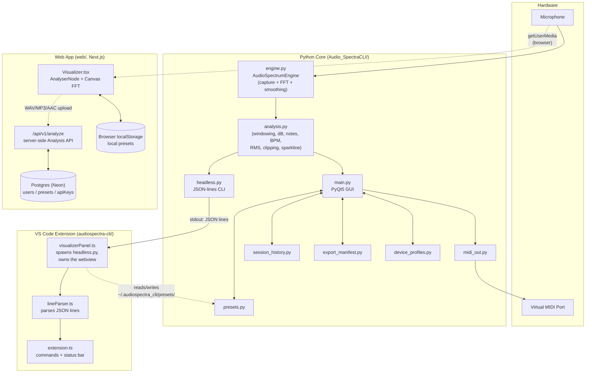
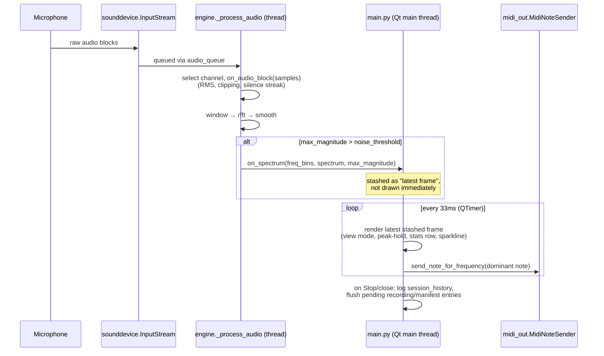
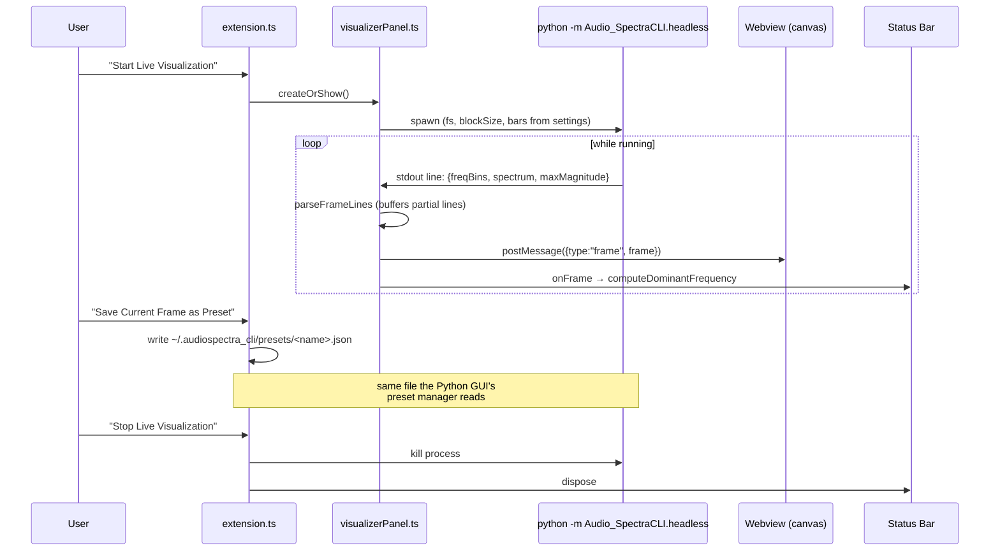
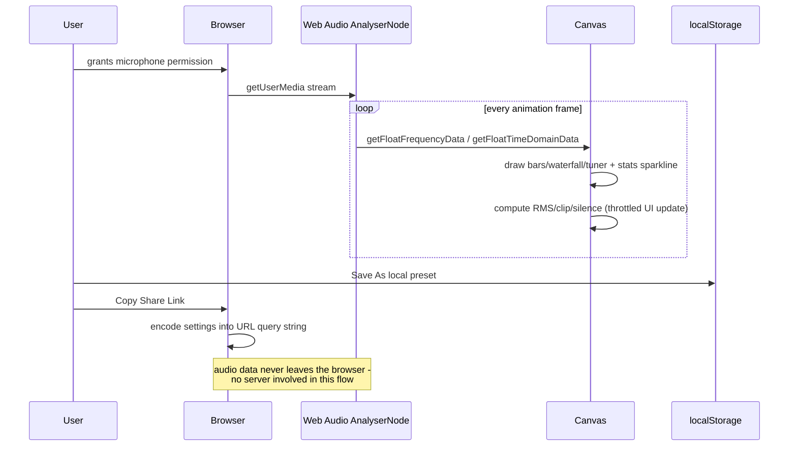
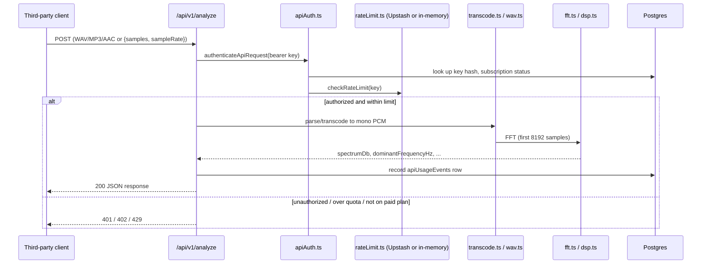
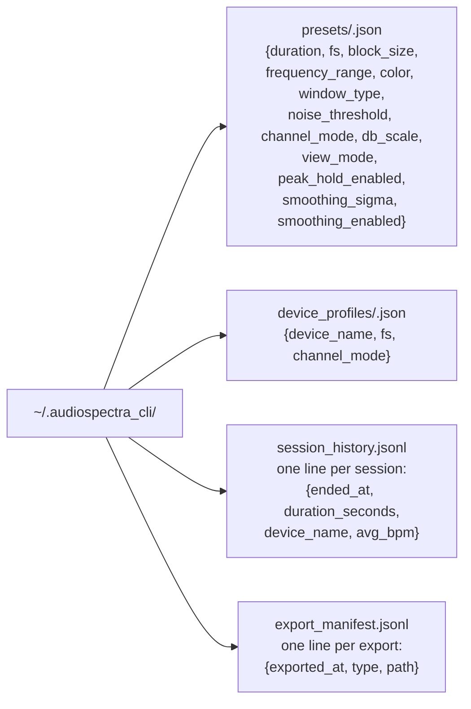
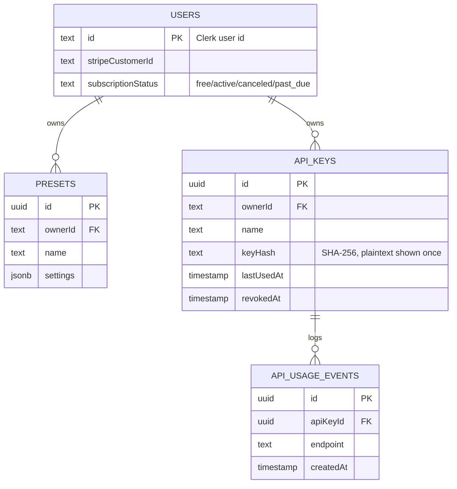

```
    _             _ _            ____                  _              ____ _     ___
   / \  _   _  __| (_) ___      / ___| _ __   ___  ___| |_ _ __ __ _ / ___| |   |_ _|
  / _ \| | | |/ _` | |/ _ \ ____\___ \| '_ \ / _ \/ __| __| '__/ _` | |   | |    | |
 / ___ \ |_| | (_| | | (_) |_____|__) | |_) |  __/ (__| |_| | | (_| | |___| |___ | |
/_/   \_\__,_|\__,_|_|\___/     |____/| .__/ \___|\___|\__|_|  \__,_|\____|_____|___|
                                      |_|
```

<div align=center>

[](https://postimg.cc/bDbrQ0Sx)

</div>

## Audio-SpectraCLI visualizes real-time audio input as a spectrum using the Fast Fourier Transform (FFT) - as a native Python/PyQt5 desktop app, a live VS Code extension, and a hosted web app with an API - all three built on the same FFT/DSP approach.

 <p>


[](https://visitorbadge.io/status?path=https%3A%2F%2Fgithub.com%2FAdityaSeth777%2FAudio-SpectraCLI)


 </p>

<a href="https://www.producthunt.com/posts/audio-spectracli?utm_source=badge-featured&utm_medium=badge&utm_souce=badge-audio&#0045;spectracli" target="_blank"></a>

---

## Table of Contents

- [What's New in v5.0.0](#whats-new-in-v500)
- [Three Products, One Engine](#three-products-one-engine)
- [Architecture](#architecture)
- [How Data Flows](#how-data-flows)
  - [1. Native GUI: capture → FFT → render → (optional) MIDI](#1-native-gui-capture--fft--render--optional-midi)
  - [2. Headless CLI → VS Code Extension](#2-headless-cli--vs-code-extension)
  - [3. Web Visualizer (client-only)](#3-web-visualizer-client-only)
  - [4. Web Data/Analysis API](#4-web-dataanalysis-api)
- [What Data Is Stored, and Where](#what-data-is-stored-and-where)
  - [Local files (Python core + VS Code extension)](#local-files-python-core--vs-code-extension)
  - [Browser storage (web visualizer)](#browser-storage-web-visualizer)
  - [Database (web SaaS backend)](#database-web-saas-backend)
- [Requirements](#requirements)
- [How to Run](#how-to-run)
  - [Native GUI](#native-gui)
  - [VS Code Extension](#vs-code-extension)
  - [Web App](#web-app)
- [Installation Methods (Native GUI)](#installation-methods--now-extension-available)
- [Current Features (as of v5.0.0)](#current-features-as-of-v500)
- [Packaging / Repo Layout](#packaging)
- [Testing](#testing)
- [Upcoming Features](#upcoming-features)
- [Contributing](#for-contributing)
- [License](#license)
- [Contact](#where-to-contact-)

---

## What's New in v5.0.0

This release adds a full CRUD-style feature layer on top of the existing engine, across all three products, **without changing the existing engine, protocols, or public API** - every prior feature keeps working exactly as before.

**Native GUI / core engine:**

- Named preset manager (save/load/rename/delete), seeded with 3 hardware-tuned builtin presets (Balanced, Low Power for constrained machines, High Detail).
- RMS meter, clip warning, and sustained-silence warning, computed from every captured audio block.
- Peak-frequency history sparkline.
- A/B settings compare (two in-memory slots).
- Local, append-only session-history log (device, duration, avg BPM), with a viewer + clear action.
- Recent Exports/Recordings manager (tracks every PNG/CSV/WAV write, with open-folder and delete actions).
- Named device profiles (matched by device *name*, not numeric index - portable across machines).

**VS Code extension:**

- Live status bar item (dominant frequency/peak magnitude while visualizing).
- `Audio-SpectraCLI: Save Current Frame as Preset` command, interoperable with the GUI's own preset store.
- Configurable visualizer bar color.

**Web visualizer:**

- `localStorage`-backed local presets - no sign-in required.
- Live session-stats panel (RMS/clip/silence + frequency sparkline), reusing data already being read each frame.
- Shareable visualizer configs via URL query parameters + a "Copy Share Link" button.

**Security & hygiene:**

- Bumped `@vscode/vsce` and `vitest` toolchains, resolving every then-open Dependabot alert reachable through real dependency resolution.
- Two bugs found and fixed via an actual end-to-end pass against real hardware (not just mocks) - see [CHANGELOG.md](./CHANGELOG.md) for specifics.

---

## Three Products, One Engine

| Product | Where | What it is |
|---|---|---|
| **Native GUI** | `Audio_SpectraCLI/main.py` | The original PyQt5 desktop app - 5 view modes, MIDI-out, exports, presets, device profiles, session history. |
| **Headless CLI** | `Audio_SpectraCLI/headless.py` | GUI-free, JSON-lines-over-stdout streaming mode. Same engine, no PyQt5 needed. |
| **VS Code Extension** | `audiospectra-cli/` | Spawns the headless CLI and renders it live inside a VS Code webview + status bar. |
| **Web App** | `web/` | A hosted, browser-only visualizer (Next.js) with accounts, billing, and a server-side Analysis API. Its DSP is a *parallel* TypeScript implementation, not shared code with the Python core. |

All four share the same conceptual FFT/windowing/downsampling approach; only the native GUI, headless CLI, and VS Code extension share actual *code* (`engine.py`/`analysis.py`) and *on-disk data* (presets, in `~/.audiospectra_cli/`).

## Architecture



## How Data Flows

### 1. Native GUI: capture → FFT → render → (optional) MIDI



### 2. Headless CLI → VS Code Extension



### 3. Web Visualizer (client-only)



### 4. Web Data/Analysis API



## What Data Is Stored, and Where

### Local files (Python core + VS Code extension)

All under `~/.audiospectra_cli/` (or `$AUDIOSPECTRA_CLI_HOME` if set, e.g. in tests) - nothing here ever leaves the machine:



Read/written by both the native GUI (`main.py`) and, for `presets/`, the VS Code extension - that's the one directory intentionally shared across products, so a preset saved in one is loadable from the other.

### Browser storage (web visualizer)

`localStorage` key `audiospectra:local-presets` on the visitor's own browser, per-origin, never sent to a server:

```json
[{ "id": "...", "name": "My Setup", "settings": { "...": "visualizer settings" }, "createdAt": "..." }]
```

### Database (web SaaS backend)

Postgres (Neon), via `drizzle-orm` - only exists once you configure `DATABASE_URL` (see [Requirements](#requirements)):



## Requirements

| Product | Requires | Notes |
|---|---|---|
| **Native GUI / headless CLI** | Python 3.9+, `numpy`, `scipy`, `matplotlib`, `sounddevice`, `pyqt5`, `mido`, `python-rtmidi` (see [requirements.txt](./requirements.txt)) | No env vars, no network, no account. `launch.py` sets all of this up in a local `.venv` automatically. |
| **VS Code Extension** | VS Code `^1.70.0`, Node (for building from source), and the Python package above importable as `python3 -m Audio_SpectraCLI.headless` | No env vars. Configurable via `audioSpectraCli.pythonPath` if `python3` isn't on `PATH`. |
| **Web App - visualizer only** | Node 20+, `npm install` | No env vars needed at all - the visualizer, local presets, session stats, and share links are 100% client-side. |
| **Web App - full SaaS (accounts, billing, Analysis API)** | The above, plus real credentials for: Clerk (auth), Stripe (billing), Neon/Postgres (`DATABASE_URL`), optionally Upstash Redis (distributed rate limiting) | See [web/.env.example](./web/.env.example) and [web/README.md](./web/README.md) for the full list and what each one gates. |

## How to Run

### Native GUI

The fastest path is the interactive launcher - see [Installation Methods](#installation-methods--now-extension-available) below for full detail. Short version:

```sh
git clone https://github.com/AdityaSeth777/Audio-SpectraCLI.git
cd Audio-SpectraCLI
./run.sh        # macOS/Linux - or double-click run.command / run.bat on Windows
```

Or manually:

```sh
python3 -m venv .venv && source .venv/bin/activate
pip install -r requirements.txt
python3 -m Audio_SpectraCLI.main
```

Headless/JSON-streaming mode (no GUI dependencies needed beyond `numpy`/`scipy`/`sounddevice`):

```sh
python3 -m Audio_SpectraCLI.headless --fs 44100 --block-size 4096 --bars 32
```

### VS Code Extension

From the Marketplace: search "Audio-SpectraCLI" in the Extensions sidebar and install - see [Installation & Usage (Marketplace)](#installation--usage-using-vscode-extensions---marketplace) below. From source:

```sh
cd audiospectra-cli
npm install
npm run compile
# then F5 in VS Code to launch an Extension Development Host
```

### Web App

```sh
cd web
npm install
cp .env.example .env.local   # fill in what you have; the visualizer works with none of it set
npm run dev                  # http://localhost:3000
```

Run the test suites:

```sh
npm run lint
npx tsc --noEmit
npx vitest run
```

`/visualize` works immediately with zero env vars. `/dashboard`, sign-in/up, and the Analysis API need Clerk/Stripe/`DATABASE_URL` configured - see [web/README.md](./web/README.md).

## Installation Methods : (Now Extension available)

<details open>

<summary> Instant Launch (interactive script - double-click and go)</summary>

If you already have the repo (`git clone` or downloaded), the fastest way to
run the native GUI is the interactive launcher - it sits alongside every
other installation method below, it doesn't replace them.

- **macOS/Linux, from a terminal**: `./run.sh` - this is the canonical
  entry point; read it if you want to know exactly what runs.
- **macOS/Linux, by double-clicking in Finder**: double-click
  **`run.command`** - Finder normally opens a plain `.sh` file in a text
  editor instead of running it, so `run.command` exists purely as a thin
  wrapper that calls `run.sh` for that double-click case. It contains no
  logic of its own.
- **Windows**: double-click **`run.bat`** (or run it from a terminal).
- **Any OS directly**: `python3 launch.py` (or `python launch.py`).

It detects your OS and Python version, checks whether `numpy`/`scipy`/
`sounddevice`/`matplotlib`/`PyQt5` are installed. If any are missing, it
offers to set up a local `.venv` next to the script and install them there
- it deliberately never tries to `pip install` straight into your system
Python, since modern Homebrew/python.org Python (and recent Linux distros)
refuse that with an "externally-managed-environment" error. After that
one-time setup, it lists your real audio input devices (via
`sounddevice.query_devices()`) so you can pick one (or just hit Enter for
the system default) - this is the only thing it asks, since it's the one
setting the GUI itself has no way to know. It then opens the GUI and starts
visualizing immediately, no extra click. Duration, sampling rate, and block
size are **not** asked in the terminal, since the GUI already has sliders
for all three once it's open - asking twice for the same thing would just
be redundant. Once `.venv` exists, later runs skip the setup check entirely
and go straight to the device prompt.

#### First time on macOS, step by step

1. **Get Python 3**, if you don't already have it: open Terminal and run
   `python3 --version`. If that fails, install Python from
   [python.org](https://python.org) (or `brew install python3` if you use
   Homebrew), then try again.
2. **Get the repo**: `git clone https://github.com/AdityaSeth777/Audio-SpectraCLI.git`
   (or download and unzip it from GitHub).
3. **Run it**: either open Terminal, `cd` into the repo folder, and run
   `./run.sh` - or double-click `run.command` in Finder.
   - Double-click, first time only: macOS may refuse to run it with an
     "unidentified developer" warning, since it isn't code-signed.
     Right-click (or Control-click) `run.command` → **Open** → confirm in
     the dialog. You only need to do this once.
4. **The launcher runs.** If packages are missing, it asks: `Set them up
   now in a local .venv (won't touch your system Python)? [Y/n]` - press
   Enter or `y`. This downloads and installs `numpy`/`scipy`/`sounddevice`/
   `matplotlib`/`PyQt5` into a `.venv` folder it creates next to the script
   (takes a minute or two; only happens once).
5. **Grant microphone access** when macOS prompts for it (a system dialog
   asking to let Terminal/Python use the microphone) - click **Allow**. If
   you miss it or previously denied it, go to **System Settings → Privacy
   & Security → Microphone** and enable it for Terminal yourself.
6. **Pick an audio input device** from the list it prints (or just press
   Enter for the default) - that's the only prompt.
7. The **GUI window opens and starts visualizing immediately** - speak or
   play audio near the selected microphone and you should see the spectrum
   move. Adjust duration/sampling rate/block size using the sliders inside
   the GUI itself.

---

</details>

----

<details>

<summary> Installation & Usage (Using VSCode Extensions - Marketplace)</summary>

# How to Use the Audio-SpectraCLI Extension

Follow these steps to use the Audio-SpectraCLI extension in Visual Studio Code:

1. **Open Visual Studio Code**
   - Launch VS Code on your computer (macOS, Windows, or Linux).

2. **Install the Audio-SpectraCLI Extension**
   - Go to the Extensions sidebar by clicking on the Extensions icon in the Activity Bar (or press `Ctrl+Shift+X` on Windows/Linux or `Cmd+Shift+X` on macOS).
   - Search for "Audio-SpectraCLI" in the Extensions Marketplace.
   - Click **Install** next to the Audio-SpectraCLI extension.

3. **Activate the Extension**
   - After installation, open the Command Palette by pressing `F1` or `Ctrl+Shift+P` on Windows/Linux or `Cmd+Shift+P` on macOS.
   - Type `>Audio-SpectraCLI: Add Sample Code` or `>Audio-SpectraCLI: View Status`.
   - Select either command to activate and use the extension.

4. **Using the Commands**
   - **Add Sample Code**: Inserts sample code for Audio-SpectraCLI into the current editor window.
     - Open any Python file or create a new one.
     - Run the command `Audio-SpectraCLI: Add Sample Code` from the Command Palette.
     - The sample code should appear in the editor.
   - **View Extension Status**: Displays the current status of Audio-SpectraCLI.
     - Run the command `Audio-SpectraCLI: View Status` from the Command Palette.
     - You’ll see a notification indicating that Audio-SpectraCLI is ready to use.
   - **Start/Stop Live Visualization**: Opens/closes a live webview panel streaming the real spectrum via the headless Python process, plus a status bar readout of the dominant frequency.
   - **Save Current Frame as Preset**: Saves the extension's current settings as a named preset, readable by the native GUI's own preset manager.

5. **Verify the Extension**
   - Ensure that the Audio-SpectraCLI commands work as expected by following the steps above.
   - You should see notifications for the status and sample code added in the editor.

6. **Customize as Needed**
   - You can modify the inserted code or use the extension as a reference for developing your own custom scripts with Audio-SpectraCLI.
   - `audioSpectraCli.pythonPath`, `sampleRate`, `blockSize`, `bars`, and `visualizerColor` are all configurable in VS Code settings.

> **Note**: If you encounter issues, check the extension's [README](./audiospectra-cli/README.md) or reach out to contact@adityaseth.in support for troubleshooting.

Enjoy using Audio-SpectraCLI in VS Code!

Once you have activated the audio_visualizer instance, feel free to use it wherever in the program. It consists of several parameters (which gives more control to the user), so make sure to configure and add those before using it in your code. Also, the user can modify (wrt [v5.0.0](https://github.com/AdityaSeth777/Audio-SpectraCLI/tree/5.0.0)) the Duration (in seconds), Sampling Rate (in Hz), and Block Size.

---

</details>

----

<details>

<summary> Installation & Usage (Using PIP on Windows)</summary>

1. Install using pip (Use pip3 instead, if pip doesn't work.)

```
pip install Audio-SpectraCLI
```

2. Import and use modules

- Create a Python file.
- You can use [Example.py](https://github.com/AdityaSeth777/Audio-SpectraCLI/blob/main/tests/test.py) as a reference or use the following code :

```python
from Audio_SpectraCLI import AudioSpectrumVisualizer
from PyQt5.QtWidgets import QApplication

# Creating an instance of AudioSpectrumVisualizer with custom parameters
app = QApplication([])
audio_visualizer = AudioSpectrumVisualizer(
    duration=5, fs=22050, block_size=1024, frequency_range=(1000, 5000), color='red')

# Starting the audio spectrum visualization
audio_visualizer.show()
app.exec_()
```

Once you have activated the audio_visualizer instance, feel free to use it wherever in the program. It consists of several parameters (which gives more control to the user), so make sure to configure and add those before using it in your code. Also, the user can modify (wrt [v5.0.0](https://github.com/AdityaSeth777/Audio-SpectraCLI/tree/5.0.0)) the Duration (in seconds), Sampling Rate (in Hz), and Block Size.

---

</details>

---

<details>

<summary> Installation & Usage (Using Homebrew and pip on MacOS)</summary>

1. Install using pip (Use pip3 instead, if pip doesn't work.)

```
brew install pyaudio
pip install Audio-SpectraCLI
```

2. Import and use modules

- Create a Python file.
- You can use [Example.py](https://github.com/AdityaSeth777/Audio-SpectraCLI/blob/main/tests/test.py) as a reference or use the following code :

```python
from Audio_SpectraCLI import AudioSpectrumVisualizer
from PyQt5.QtWidgets import QApplication

# Creating an instance of AudioSpectrumVisualizer with custom parameters
app = QApplication([])
audio_visualizer = AudioSpectrumVisualizer(
    duration=5, fs=22050, block_size=1024, frequency_range=(1000, 5000), color='red')

# Starting the audio spectrum visualization
audio_visualizer.show()
app.exec_()
```

Once you have activated the audio_visualizer instance, feel free to use it wherever in the program. It consists of several parameters (which gives more control to the user), so make sure to configure and add those before using it in your code. Also, the user can modify (wrt [v5.0.0](https://github.com/AdityaSeth777/Audio-SpectraCLI/tree/5.0.0)) the Duration (in seconds), Sampling Rate (in Hz), and Block Size.

---

</details>


---

<details>

<summary> Examining & Usage (Using Docker) </summary>

1. Prerequisites
   You should have docker installed on your machine. You can download and install Docker from [here](https://www.docker.com/products/docker-desktop).
2. Pulling the Docker Image

You can pull the pre-built Docker image from Docker Hub using the following command:

```sh
docker pull adityaseth777/audio-spectracli
```

3. Viewing Files Inside the Docker Container
   For seeing the files inside the Docker container for debugging purposes, you can run an interactive shell session:

```sh
docker run --rm -it --entrypoint /bin/bash audio-spectracli
```

4. Use the 'ls' command to view the files and get a proper understanding of the file structure :

```sh
ls
```

5. You can use [Example.py](https://github.com/AdityaSeth777/Audio-SpectraCLI/blob/main/tests/test.py) as a reference or use the following code :

```python
from Audio_SpectraCLI import AudioSpectrumVisualizer
from PyQt5.QtWidgets import QApplication

# Creating an instance of AudioSpectrumVisualizer with custom parameters
app = QApplication([])
audio_visualizer = AudioSpectrumVisualizer(
    duration=5, fs=22050, block_size=1024, frequency_range=(1000, 5000), color='red')

# Starting the audio spectrum visualization
audio_visualizer.show()
app.exec_()
```

Once you have activated the audio_visualizer instance, feel free to use it wherever in the program. It consists of several parameters (which gives more control to the user), so make sure to configure and add those before using it in your code. Also, the user can modify (wrt [v5.0.0](https://github.com/AdityaSeth777/Audio-SpectraCLI/tree/5.0.0)) the Duration (in seconds), Sampling Rate (in Hz), and Block Size.

---

</details>

---

<details>

<summary> Building the Docker Image Locally </summary>

If you prefer to build the Docker image locally, follow these steps:

1. Clone the repository :

```sh
git clone https://github.com/AdityaSeth777/Audio-SpectraCLI.git
cd Audio-SpectraCLI
```

2. Build the Docker image:

```sh
docker build -t audio-spectracli .
```

3. Viewing Files Inside the Docker Container
   For seeing the files inside the Docker container for debugging purposes, you can run an interactive shell session:

```sh
docker run --rm -it --entrypoint /bin/bash audio-spectracli
```

4. Use the 'ls' command to view the files and get a proper understanding of the file structure :

```sh
ls
```

5. You can use [Example.py](https://github.com/AdityaSeth777/Audio-SpectraCLI/blob/main/tests/test.py) as a reference or use the following code :

```python
from Audio_SpectraCLI import AudioSpectrumVisualizer
from PyQt5.QtWidgets import QApplication

# Creating an instance of AudioSpectrumVisualizer with custom parameters
app = QApplication([])
audio_visualizer = AudioSpectrumVisualizer(
    duration=5, fs=22050, block_size=1024, frequency_range=(1000, 5000), color='red')

# Starting the audio spectrum visualization
audio_visualizer.show()
app.exec_()
```

Once you have activated the audio_visualizer instance, feel free to use it wherever in the program. It consists of several parameters (which gives more control to the user), so make sure to configure and add those before using it in your code. Also, the user can modify (wrt [v5.0.0](https://github.com/AdityaSeth777/Audio-SpectraCLI/tree/5.0.0)) the Duration (in seconds), Sampling Rate (in Hz), and Block Size.

</details>

---

## Current Features (as of v5.0.0)

- Real-time visualization of Fast Fourier Transform (FFT) spectrum of audio input.
- Live VS Code Extension support - the extension spawns a real headless
  audio process and streams the spectrum into a live webview canvas, with
  a live status bar readout (see [Web & Extension Additions](#web--extension-additions) below).
- Support for adjusting parameters such as duration, sampling rate, and block size.
- Seamless integration with SoundDevice for audio input capture.
- Customizable Frequency Range: Allow users to specify the frequency range to display in the spectrum.
- Color Customization: Provide options for users to customize the colors used in the spectrum visualization.
- Added PyQt5 modules and a Gaussian filter that enables user input for Duration (in seconds), Sampling Rate (in Hz), Block Size, and also smoothens the output.
- Might need to keep in mind that the Gaussian filter is too strong and it won't recognise any noise and display it's spectra. Only actual input through mic such as conversations and music are displayed which can be categorised as real inputs or audio, and of course in real time.
- Much more dynamic and user-controlled interface.
- A headless, GUI-free streaming mode (`python -m Audio_SpectraCLI.headless`)
  that emits spectrum frames as JSON lines - the same audio/FFT engine that
  powers the GUI, usable from scripts or other tools without PyQt5 installed.
- The GUI redraws at a fixed ~30fps from the latest audio frame rather than
  redrawing on every single incoming audio block. Real microphone input can
  deliver far more blocks per second than a matplotlib redraw can keep up
  with, which previously could back up the GUI's event queue and, on some
  PyQt5/sip builds, crash the whole app outright after sustained use. Any
  error during a redraw is now also caught and logged instead of being
  allowed to propagate and abort the process.
- The GUI's canvas now resizes properly on window maximize (no clipped axis
  labels), and every slider (Duration/Sampling Rate/Block Size/Noise
  Threshold) has a paired numeric spinbox next to it - the exact value is
  always visible and directly typeable, not just draggable.
- Five view modes: **Line** (the original), **Bars** (equalizer-style),
  **Waterfall** (scrolling history spectrogram), **Circular** (radial
  display), and **Tuner** (big musical-note readout for the dominant
  frequency, e.g. "A4 · 441.4 Hz · +6 cents").
- **dB (logarithmic) scale** toggle, **windowing function** choice
  (None/Hann/Hamming/Blackman) to reduce spectral leakage, an adjustable
  **noise threshold** and **Gaussian smoothing strength** (previously
  hardcoded), and **stereo channel selection** (Mono mix/Left/Right -
  previously always forced mono).
- **Peak-hold markers** (Line/Bars views) - a line that holds at the recent
  peak and decays, like a hardware audio meter.
- **Live BPM estimation** and a **dominant-note readout**, always shown
  above the canvas regardless of view mode. The BPM estimate is a simple
  onset/energy heuristic, not lab-grade beat tracking - expect it to be
  unstable on non-rhythmic input, that's inherent to how simple it is.
- **RMS meter, clip warning, and silence warning**, plus a **peak-frequency
  sparkline** - see [What's New in v5.0.0](#whats-new-in-v500).
- **Named preset manager** (save/load/rename/delete) with 3 hardware-tuned
  builtins, alongside the original file-picker save/load presets.
- **A/B settings compare**, a **local session-history log**, a **Recent
  Exports/Recordings manager**, and **named device profiles** - all new in
  v5.0.0, see above.
- **Export** the current view as PNG (also bound to Ctrl+S) or the current
  frame's data as CSV, and **record microphone input to a WAV file** - now
  tracked in the Recent Exports manager.
- **In-GUI microphone selection** (previously only choosable via the
  `launch.py` interactive launcher at startup) - swap devices from a
  dropdown before clicking Start; changing it while running is disabled,
  the same way sampling rate/block size are, since a live stream can't be
  reconfigured without reopening it.
- **MIDI-out**: converts the dominant frequency to a MIDI note and sends it
  to a virtual MIDI port, turning the visualizer into a simple audio-to-MIDI
  tool. `mido`/`python-rtmidi` are core dependencies (installed
  automatically by `requirements.txt`/`pip install Audio-SpectraCLI`/the
  interactive launcher's `.venv` setup) - but the checkbox still degrades
  gracefully with a clear explanation instead of crashing if they're somehow
  missing or fail to build in a given environment. Windows has no native
  virtual MIDI port support without a third-party loopback driver like
  loopMIDI; the same message covers that case too. A stuck note is released
  automatically both when input goes quiet for 0.5s and when you click Stop.

## Packaging

```
Audio-SpectraCLI/

├── .gitignore
├── CODE_OF_CONDUCT.md
├── Contributing.md
├── Dockerfile
├── LICENSE
├── Readme.md
├── CHANGELOG.md
├── requirements.txt
├── setup.cfg
├── setup.py
├── launch.py           # interactive cross-platform launcher (see Instant Launch)
├── run.sh              # canonical launcher entry point for macOS/Linux terminals: ./run.sh
├── run.command         # thin double-click wrapper around run.sh, for macOS/Linux Finder
├── run.bat             # double-click/terminal entry point for Windows
├── .github/
│   └── workflows/
│       ├── docker-publish.yml
│       ├── label.yml
│       └── python-publish.yml
├── Audio_SpectraCLI/
│   ├── main-old.py       # deprecated v3.2 implementation
│   ├── main.py            # PyQt5 GUI, built on engine.py
│   ├── engine.py           # Qt-independent capture/FFT/smoothing core, shared by main.py and headless.py
│   ├── analysis.py         # pure DSP helpers: windowing, dB, notes, BPM, RMS, clipping, sparkline
│   ├── midi_out.py         # optional MIDI-out (gracefully degrades if python-rtmidi isn't installed)
│   ├── headless.py         # `python -m Audio_SpectraCLI.headless` JSON-streaming CLI mode
│   ├── presets.py          # named-preset CRUD (~/.audiospectra_cli/presets/)
│   ├── device_profiles.py  # named device-profile CRUD, matched by device name
│   ├── session_history.py  # append-only session log (~/.audiospectra_cli/session_history.jsonl)
│   ├── export_manifest.py  # tracked PNG/CSV/WAV exports (~/.audiospectra_cli/export_manifest.jsonl)
│   └── __init__.py
├── tests/
│   ├── test-old.py
│   ├── test.py
│   ├── test_engine.py
│   ├── test_headless.py
│   ├── test_analysis.py
│   ├── test_midi_out.py
│   ├── test_presets.py
│   ├── test_device_profiles.py
│   ├── test_session_history.py
│   ├── test_export_manifest.py
│   ├── test_gui_smoke.py
│   ├── test_gui_stress.py
│   ├── test_gui_controls.py
│   └── test_gui_features.py
├── audiospectra-cli/         # VS Code extension (live webview + status bar)
│   ├── assets
│   ├── dist
│   ├── src/
│   │   ├── test
│   │   ├── extension.ts
│   │   ├── visualizerPanel.ts
│   │   ├── lineParser.ts
│   │   ├── lineParser.test.ts
│   │   ├── presetUtils.ts
│   │   └── presetUtils.test.ts
│   ├── CHANGELOG.md
│   ├── esbuild.js
│   ├── eslint.config.mjs
│   ├── package.json
│   ├── package-lock.json
│   ├── README.md
│   ├── sample.py
│   └── tsconfig.json
└── web/                       # Next.js SaaS app: hosted visualizer, accounts/billing, analysis API
    ├── app/
    ├── components/
    ├── lib/
    │   ├── localPresets.ts     # localStorage-backed presets (no sign-in)
    │   ├── sessionStats.ts     # RMS/clip/silence math
    │   ├── urlConfig.ts        # shareable-URL settings encode/decode
    │   └── db/                 # drizzle schema: users, presets, apiKeys, apiUsageEvents
    └── README.md
```

## Testing

```sh
# Python core (from repo root, inside a venv with requirements.txt installed)
python3 -m pytest tests/ --ignore=tests/test.py --ignore=tests/test-old.py

# VS Code extension
cd audiospectra-cli && npm run compile && npm run lint && npm run test:unit

# Web app
cd web && npx tsc --noEmit && npm run lint && npx vitest run
```

All three suites are green as of this release; the Python suite additionally gets exercised against real microphone hardware as part of manual end-to-end passes (not run in CI, since CI has no audio device).

## Web & Extension Additions

Audio-SpectraCLI is expanding beyond the native Python CLI into a small
family of products that all sit on top of the same FFT/DSP approach:

- **Hosted web visualizer** (`web/`) - a Next.js app with a client-side
  (browser-only, mic audio never leaves the device) visualizer, free vs.
  paid tiers (waterfall/tuner/export/presets are paid), Clerk accounts, and
  Stripe subscription billing. See [web/README.md](./web/README.md) for
  setup - it needs your own Clerk, Stripe, and Postgres (Neon) credentials
  to run the account/billing/Analysis-API side; the visualizer itself,
  local presets, session stats, and share links work with zero env vars.
- **Live VS Code extension** (`audiospectra-cli/`) - the extension spawns
  `python -m Audio_SpectraCLI.headless` and streams the live spectrum into
  a real webview panel inside VS Code (`Audio-SpectraCLI:
  Start/Stop Live Visualization`), plus a live status bar readout and a
  save-preset command interoperable with the native GUI. Requires Python +
  this package installed and on your `PATH` (configurable via the
  `audioSpectraCli.pythonPath` setting). See
  [audiospectra-cli/README.md](./audiospectra-cli/README.md).
- **Data/Analysis API** (`web/app/api/v1/analyze`) - a server-side HTTP API
  for third parties: send WAV audio or raw PCM samples, get back spectrum
  and dominant-frequency JSON. Authenticated with per-account API keys,
  rate-limited, and billed on a usage basis. See
  [web/README.md](./web/README.md) for the request/response shape.

The native Python CLI (`main.py`/`AudioSpectrumVisualizer`) is unaffected -
it now runs on the same shared `engine.py` internally, but its behavior and
public API are unchanged.

## Upcoming Features

- CLI endpoints. ✅ Done - see `python -m Audio_SpectraCLI.headless` above.
- Save and Export: ✅ Done in the web visualizer (PNG export, paid tier) and
  the native GUI (PNG/CSV export, WAV recording, all now tracked in the
  Recent Exports manager).
- Option to choose between CLI/GUI. ✅ Done - `main.py` (GUI) vs.
  `headless.py` (CLI/JSON streaming) both run on the same engine.
- Named presets/device profiles/session history/A-B compare. ✅ Done - v5.0.0.
- Server-side decoding of compressed audio formats (MP3/AAC) for the
  Analysis API - currently WAV-only for the raw-sample path (MP3/AAC are
  transcoded server-side via `ffmpeg-static` for file uploads).
- A shared, multi-instance-safe rate limiter (e.g. Redis/Upstash) for the
  Analysis API. ✅ Done - Upstash-backed with an in-memory fallback.
- MIDI output port/channel profiles (named, like device profiles).
- Cross-device sync for local (non-DB) presets.

---

## For contributing

Check the [Contributing page.](https://github.com/AdityaSeth777/Audio-SpectraCLI/blob/main/Contributing.md)

## License

[MIT © Aditya Seth](https://github.com/AdityaSeth777/Audio-SpectraCLI/blob/main/LICENSE)

## What next?

I will be improving this project.

## Where to contact ?

Contact: [contact@adityaseth.in](mailto:contact@adityaseth.in?subject=Email%20owing%20to%20adityaseth.in&body=Greetings%2C%0AI%20am%20%5Bname%5D.%20I%20just%20came%20across%20your%20website%20and%20was%20hoping%20to%20talk%20to%20you%20about%20something.)

## 🙋‍♂️ Support

💙 If you like this project, give it a ⭐ and share it with friends! <br><br>

[](https://www.buymeacoffee.com/adityaseth)

---

# Made with  and 
